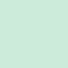
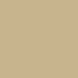
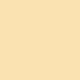

# Included colours

	
 Dark 

	<table>
		<table>
			<tr>
				<th></th>
				<th>Labels</th>
				<th>Function</th>
				<th>Hex</th>
				<th>RGB</th>
				<th>HSL</th>
			</tr>
			<tr>
				<td></td>
				<td>Cod Gray</td>
				<td>Background</td>
				<td><code>#181818</code></td>
				<td><code>RGB(13, 13, 10)</code></td>
				<td><code>hsl(60, 13%, 5%)</code></td>
			</tr>
			<tr>
				<td></td>
				<td>Westar</td>
				<td>Foreground</td>
				<td><code>#dedcd1</code></td>
				<td><code>RGB(214, 212, 203)</code></td>
				<td><code>hsl(49, 12%, 82%)</code></td>
			</tr>
			<tr>
				<td></td>
				<td>Black</td>
				<td>Color16</td>
				<td><code>#212120</code></td>
				<td><code>RGB(33, 33, 32)</code></td>
				<td><code>hsl(60, 3%, 13%)</code></td>
			<tr>
			</tr>
			<tr>
				<td></td>
				<td>Black Bright</td>
				<td>Color8</td>
				<td><code>#3b3b39</code></td>
				<td><code>RGB(59, 59, 57)</code></td>
				<td><code>hsl(60, 3%, 23%)</code></td>
			<tr>
				<td></td>
				<td>Copper Rust</td>
				<td>Color1</td>
				<td><code>#9D504A</code></td>
				<td><code>RGB(157, 80, 74)</code></td>
				<td><code>hsl(4, 35%, 45%)</code></td>
			</tr>
			<tr>
				<td></td>
				<td>Burnt Sienna</td>
				<td>Color9</td>
				<td><code>#ED6D61</code></td>
				<td><code>RGB(237, 109, 97)</code></td>
				<td><code>hsl(5, 79%, 65%)</code></td>
			<tr>
				<td></td>
				<td>Oxley</td>
				<td>Color2</td>
				<td><code>#7A9E8A</code></td>
				<td><code>RGB(122, 158, 138)</code></td>
				<td><code>hsl(135, 17%, 56%)</code></td>
			</tr>
			<tr>
				<td></td>
				<td>Skeptic</td>
				<td>Color10</td>
				<td><code>#CCEBDA</code></td>
				<td><code>RGB(204, 235, 218)</code></td>
				<td><code>hsl(135, 44%, 85%)</code></td>
			<tr>
				<td></td>
				<td>Indian Khaki</td>
				<td>Color3</td>
				<td><code>#C7B48D</code></td>
				<td><code>RGB(199, 180, 141)</code></td>
				<td><code>hsl(40, 30%, 65%)</code></td>
			</tr>
			<tr>
				<td></td>
				<td>Peach Yellow</td>
				<td>Color11</td>
				<td><code>#fae2b1</code></td>
				<td><code>RGB(250, 226, 177)</code></td>
				<td><code>hsl(40, 88%, 84%)</code></td>
			</tr>
			<tr>
				<td></td>
				<td>Trendy Pink</td>
				<td>Color4</td>
				<td><code>#997aa2</code></td>
				<td><code>RGB(153, 122, 162)</code></td>
				<td><code>hsl(287, 18%, 56%)</code></td>
			</tr>
			<tr>
				<td></td>
				<td>Prelude</td>
				<td>Color12</td>
				<td><code>#dcb8e6</code></td>
				<td><code>RGB(221, 185, 230)</code></td>
				<td><code>hsl(288, 47%, 81%)</code></td>
			</tr>
			<tr>
				<td></td>
				<td>Can Can</td>
				<td>Color5</td>
				<td><code>#d48ca6</code></td>
				<td><code>RGB(212, 140, 166)</code></td>
				<td><code>hsl(340, 46%, 68%)</code></td>
			</tr>
			<tr>
				<td></td>
				<td>Cotton Candy</td>
				<td>Color13</td>
				<td><code>#ffc2d8</code></td>
				<td><code>RGB(255, 194, 216)</code></td>
				<td><code>hsl(340, 100%, 88%)</code></td>
			</tr>
			<tr>
				<td></td>
				<td>Breaker Bay</td>
				<td>Color6</td>
				<td><code>#60a3a3</code></td>
				<td><code>RGB(96, 163, 163)</code></td>
				<td><code>hsl(180, 27%, 51%)</code></td>
			</tr>
			<tr>
				<td></td>
				<td>Half Baked</td>
				<td>Color14</td>
				<td><code>#8ecfcf</code></td>
				<td><code>RGB(142, 207, 207)</code></td>
				<td><code>hsl(180, 40%, 68%)</code></td>
			</tr>
			<tr>
				<td></td>
				<td>Gray Nickle</td>
				<td>Color7</td>
				<td><code>#c4c3be</code></td>
				<td><code>RGB(196, 195, 190)</code></td>
				<td><code>hsl(45, 5%, 76%)</code></td>
			</tr>
			<tr>
				<td></td>
				<td>Alto</td>
				<td>Color15</td>
				<td><code>#dbdbdb</code></td>
				<td><code>RGB(219, 219, 219)</code></td>
				<td><code>hsl(0, 0%, 86%)</code></td>
			</tr>
		</table>
	</table>

